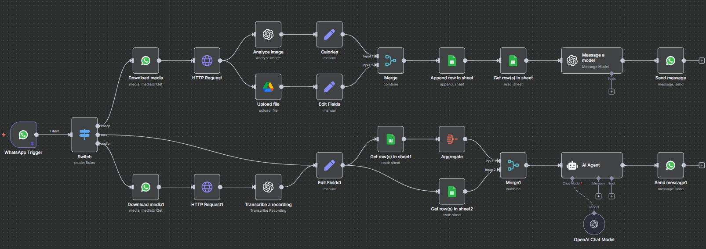

# WhatsApp Food Tracker Automation

- Processes images, audio messages, and text requests from WhatsApp to analyze food and drink consumption.
- Updates Google Sheets with food history and provides personalized responses using AI models.

## Demo

  

## Workflow Architecture

## How It Works

1. **WhatsApp Trigger**: The workflow starts when a new message (text, image, or audio) is received on WhatsApp.
2. **Switch Node**: Determines the type of message (text, image, or audio) and routes it accordingly.
3. **Image Path**:
   - Downloads the image.
   - Sends it to an HTTP request for analysis.
   - Extracts calories information.
   - Updates Google Sheets with the food entry.
   - Reads back data from the sheet and sends it to the AI model for response generation.
4. **Audio Path**:
   - Downloads the audio message.
   - Transcribes it to text.
   - Processes it with AI to extract user requests.
   - Updates Google Sheets and aggregates data for AI response.
5. **Text Request Path**:
   - Edits fields as needed.
   - Reads Google Sheets for user’s food history.
   - Merges with aggregated data.
   - AI agent generates a personalized response.
6. **Response**:
   - The AI-generated message is sent back to the user via WhatsApp.

## Key Components

- **Download media**: Fetch images or audio messages from WhatsApp.
- **HTTP Request**: Communicate with APIs for analysis.
- **Edit Fields**: Preprocess or enrich the data before storing.
- **Google Sheets**: Stores and retrieves user food history.
- **Aggregate & Merge**: Combine historical data for AI analysis.
- **AI Agent**: Generates dietary advice and responses.
- **Send Message**: Responds to the user on WhatsApp.

## Requirements

- [n8n](https://n8n.io/) workflow automation platform
- WhatsApp API access
- Google Sheets API credentials
- OpenAI API key

## Setup 

1. Open **n8n** online and create a new workflow.  
2. Follow all prompts in n8n to configure nodes.  
3. Use `food_images_analysis.ipynb` for image processing instructions.  
4. Use `text_voice_requests.md` for handling text and voice messages.  
5. Start the workflow to automate WhatsApp food tracking.

## Acknowledgements

- [n8n](https://n8n.io/) for workflow automation.  
- OpenAI API for AI-based analysis.  
- Google Sheets & Drive APIs for data storage.  
- Tutorial inspiration from [YouTube](https://www.youtube.com/@EdHillAI) channel.

## License

This project is licensed under the MIT License - see the [LICENSE](LICENSE) file for details.

## Contributing

Contributions are welcome! Please feel free to submit a Pull Request.