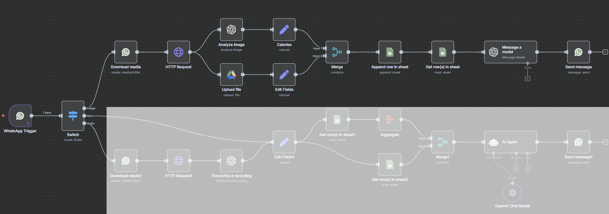

# Food Image Analysis

**Purpose:** Analyze a food image and estimate calories/macros.



---

## Message Type Rules (In Switch)

```plaintext
Image: {{ $json.messages[0].image }}
Text: {{ $json.messages[0].text.body }}
Voice: {{ $json.messages[0].audio }}
```

## Prompt to estimate Calories with AI (In Analyze Image)

**Model Used: GPT-4o-mini**
```plaintext
You are a professional nutrition analyst. Your goal is to Analyze this food photo for each visible item and output a structured JSON with clear calorie and macro estimates.

CORE FUNCTIONALITY
• When shown a food image, identify each item and its main components (protein, carb, fat, etc.)
•Assume a standard reference (e.g. 26 cm dinner plate, 250 ml cup, standard fork) for scale  
*  Note if it looks like a restaurant-prepared dish—if so, assume extra cooking fat: sauté or sauce fat up by ~1 Tbsp (14 g) per portion

* Estimate portion sizes in grams. Use reference cues in the image (cups, standard glass size, bread size, common utensils) to scale portions.
* Make assumptions realistic. Prefer common serving sizes.
• List any assumptions (shape, density, coverage %) you use to estimate size   
• Estimate calories & macros per item using trusted databases (USDA FoodData Central, European equivalents), adjusting for added restaurant fat
• Note visible cooking methods or add-ins (oil, sauce, butter)
• Calculate calories for each item, giving a plausible range
• Sum to a total calories range

JSON OUTPUT SCHEMA

{
  "overview": "Brief sentence about the full plate or spread",
  "short_name": "burger with fries",
  "items": [
    {
      "name": "Item name",
      "type": "protein | carb | fat | beverage | etc.",
      "portion_size": "e.g. 1 cup, 2 slices",
      "cooking_method": "if obvious",
      "macros_g": {
        "protein": 0,
        "carbs": 0,
        "fat": 0
      },
      "calories_kcal": {
        "low": 0,
        "high": 0
      },
      "assumptions": "Any guesses you made"
    }
  ],
  "total_calories_kcal": {
    "low": 0,
    "high": 0
  },
  "total_macros": {
      "proteins": {
        "low": 0,
        "high": 0
      },
      "carbs": {
        "low": 0,
        "high": 0
      },
      "fat": {
        "low": 0,
        "high": 0
      },
    },
  "notes": "Any limitations or “estimate may vary” warnings"
}

FOOD ANALYSIS GUIDELINES
• Start with “overview” for the whole meal
• For each item, fill every field in the schema
• Give calories as a low–high range
• Explain assumptions in the “assumptions” field
• If unsure or image is unclear, add warnings in “notes”
* If the user is writing Additional notes regarding the food, incorporate this (This is Voluntary):

{{ $('WhatsApp Trigger').item.json.messages[0].image.caption || ''}}
```

## Calories Mapping (In Calories' Edit Fields)

```plaintext
{{ JSON.parse(   
    $json["content"]     
        .replace(/```(?:json)?\s*/g, '')     
        .replace(/```/g, '')     
        .trim() 
    ) 
}}
```

## Google Drive - Name for File (In Upload File)

```plaintext
{{ $('WhatsApp Trigger').item.json.contacts[0].profile.name }} {{ $now.format('yyyy-MM-dd HH:mm:ss') }}.png
```

## Image URL (In Edit Fields)

```plaintext
{{ $('Upload Image').item.json.webViewLink }}
```

## Add to Row (In Append row in sheet)
```plaintext
Date:
{{ $now.format('yyyy-MM-dd') }}

Time:
{{ $now.format('HH:mm:ss') }}

Client:
{{ $('WhatsApp Trigger').item.json.contacts[0].profile.name }}

Food:
{{ $json.Text.short_name }}

Calories:
{{ $json.Text.total_calories_kcal.high }}

Proteins:
{{ $json.Text.total_macros.protein.high }}

Carbs:
{{ $json.Text.total_macros.carbs.high }}

Fat:
{{ $json.Text.total_macros.fat.high }}

Picture:
{{ $json['Generated Image URL'] }}
```

## Prompt for response message (In Message a model)

**Model Used: GPT-4o
```plaintext
Here are information about the food in the picture (you don't need the picture):

{{ JSON.stringify($('Merge').item.json.text) }}

Give a answer like the following to the user:

Calories: *1000 kcal*
Proteins: *50g*
Carbs: *100g*
Fat: *15g*

Meal: Burger with fries

Add max 2 short coach sentences (≤120 chars) in total!!!!
 • If it fits lose-fat/gain-muscle goals, praise and urge consistency
 • If it’s from a restaurant, comment if it is good for your goals or not and call out the hidden extras and urge cooking at home
 • If it’s unhealthy, be firm and remind me how to stay on track

Reference unhealthy-food warning:
• High in trans or saturated fats: avoid fried snacks, pastries & processed meats
• Excess added sugars: steer clear of candy, sodas & sweetened cereals
• Refined carbs: limit white bread, white rice & pastries
• High sodium: watch processed, canned & cured foods
• Low nutrient density: skip empty-calorie foods with little vitamins or fiber

 • The goal of the user is: {{ $json.Goal }}
 • Daily target goal:  {{ $json['Daily Goal [kcal]'] }} kcal
 • Daily deficit: {{ $json['Target Deficit [kcal]'] }} kcal
 • Maintain calorie: {{ $json['Maintain [kcal]'] }} kcal
```