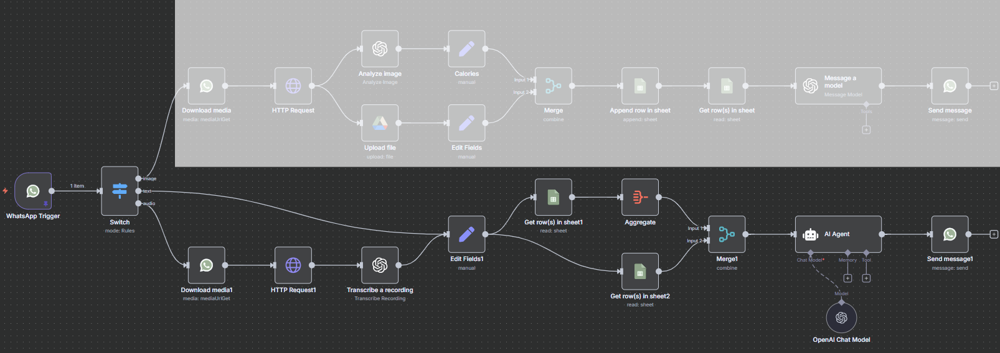

# Handle Text and Voice Requests

**Purpose:** Analyze Google Sheets food history and process user requests about what foods or drinks they can have.



---

## Extracting Text Request (In Edit Fields 1)

```plaintext
{{  
  $('WhatsApp Trigger').item.json.messages 
    && $('WhatsApp Trigger').item.json.messages[0]?.text?.body 
      ? $('WhatsApp Trigger').item.json.messages[0].text.body 
      : $('Transcribe a recording').item.json.text  
}}
```

## Prompt to Analyze Food History and Provide a response (In OpenAI Chat Model)

```plaintext
Analyze the food history from the last 7 days (or y days if fewer).
My name is {{ $('WhatsApp Trigger').item.json.contacts[0].profile.name }}
Request: {{ $('Edit Fields1').item.json['User Request'] }}
Today is {{ $now }}
My goal is {{ $json.Goal }}
Daily goal: {{ $json['Daily Goal [kcal]'] }} kcal


* In your answer write out numbers e.g. instead of 1000 you write one thousand and round off to the next 100.
If the requested item is a drink (cocktail, beer, etc.), calculate how many standard servings I can have until I hit my allowed calories.  
• If the requested item is a single-portion food (pizza, burger with fries, etc.), assume only one serving and tell me if I can have it or should skip it.  


* Sum calories consumed over the last seven days (including today)  
• Compute total allowed calories for those days (daily goal × days)  
• Subtract to find remaining “allowed calories”  
• Look up calories per one standard serving of the requested item  
• If it’s a drink, calculate max servings until allowed calories reaches zero; if it’s single-portion food, just compare one serving to allowed calories  

Output in simple language (sixth–eighth grade level), no more than one short sentence: You have so much calories left, so you can eat/drink (request) and maintain your last-y-day deficit.”

Or: You have so much calories left, so you can't eat/drink (request) and maintain your last-y-day deficit.

Here is my Meal history:

{{ JSON.stringify($('Aggregate').item.json.data, null, 2) }}
```